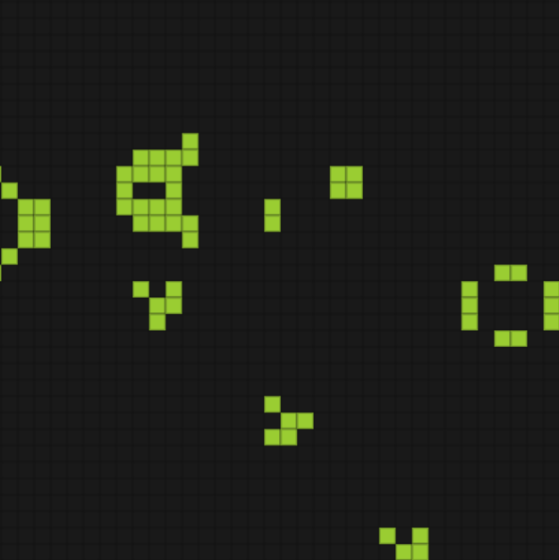

# Cellular Automata

###### Coding an Elementary Cellular Automaton & Conway's Game of Life

-------------------------------------

### In this repo:

There are two main files, **elemCA.py** and **conwayCA.js**. The first is meant to be run locally and prints a rule 110 elementary cellular automata to the terminal for 300 generations. The second is a *p5.js* script that runs in the *index.html* file. Additionally there is a test script in the *deprecated* folder for trying dynamic printing to the terminal.

-------------------------------------

### What is a cellular automaton?

A cellular automaton (CA) is an evolving, "living" system that forms complex and repetetive behavior from a few simple rules. Basically the entire world of a CA evolves every timestep, with each cell either surviving, dying, or coming to life depending on the state of the previous generation. A CA can really live in N-dimensional space, but the most commonly studied and emulated CAs live in 2D space--a grid.

Each  cell in this grid has 8 neighbors surrounding them (fig. 1). The evolution of this cell depends only on how many of these neighbors are alive or dead. A cell is said to exist if it is alive, and is considered nonesxistant otherwise (even though the point on the grid still exists). In this version of a CA--modled after Conway's Game of Life, the most famous CA--a cell survies if there are 2 or 3 neighbors and dies otherwise; a dead cell comes to life if there are exactly 3 neighbors and stays dead otherwise. In the nomenclature of CA this ruleset is **S23B3**, or **S***urvives with 2 or 3 neighbors*, is **B***orn with exactly 3 neighbors*, and dies otherwise.

-------------------------------------

### Changes